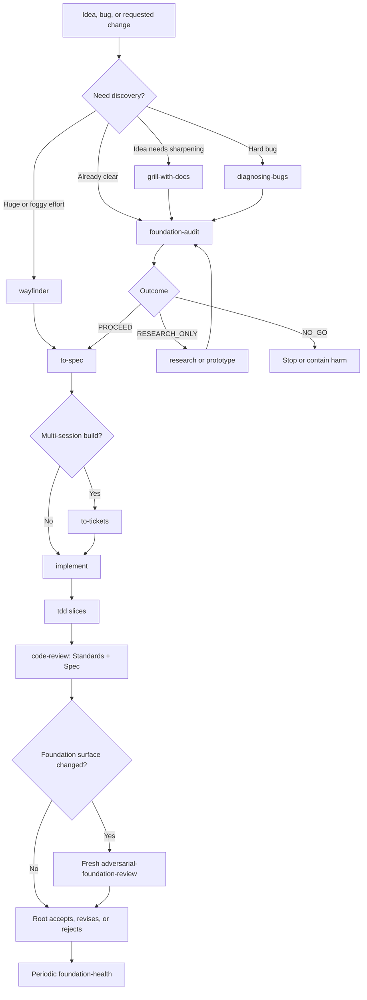

# Foundation Integrity

**Stop locally correct work from hardening the wrong foundation.**

Foundation Integrity is a project-scoped engineering workflow for Codex and Claude
Code. It checks ownership, source of truth, lifecycle, trust boundaries, dependency
direction, invariants, and system shape before an agent freezes a feature into code,
schemas, migrations, or durable interfaces.

The distribution is shell-only, transparent, conflict-aware, and inert until used.
It installs 24 skills, proof-selection guidance, proportional hooks, and an optional
external-coworker policy without changing global runtime configuration.

## Project spec

| Property | Contract |
| --- | --- |
| Goal | Prevent a green local implementation from strengthening the wrong owner, authority, lifecycle, or system archetype. |
| Supported runtimes | Codex, Claude Code, or both in one repository. |
| Distribution | One shell adoption lifecycle; `full-opt` is the only payload. |
| Canonical skill source | `skills/`; runtime copies under `.agents/skills/` and `.claude/skills/` are generated projections. |
| Skill inventory | Exactly 24 skills: 3 first-party Foundation Integrity skills and 21 commit-pinned companion skills. |
| Default enforcement | Runtime and pre-commit checks warn; blocking pre-push is opt-in. |
| Runtime state | `.foundation/`, `tmp/`, local research, receipts, and numbered ADR history are non-canonical working state. |
| Existing project instructions | Existing `AGENTS.md` and `CLAUDE.md` are never overwritten; a compact `AGENTS.md` is created only when absent. |
| Acceptance | Feature correctness is necessary but insufficient; acceptance must exercise the architectural property at risk. |
| Non-goals | No hidden task engine, global configuration takeover, automatic session spawning, or autonomous acceptance authority. |

## Core workflow



The foundation gate always returns exactly:

- one classification: `FOUNDATION_OK`, `FOUNDATION_SUSPECT`, or
  `FOUNDATION_BLOCKED`;
- one outcome: `PROCEED`, `RESEARCH_ONLY`, or `NO_GO`; and
- one route: Foundation-first, Bounded compatibility, or Feature-first.

Only `PROCEED` unlocks dependent design or implementation. Unknown load-bearing
facts are research blockers, not assumptions.

## Install

Run from the target repository and select exactly one runtime mode:

```bash
# Codex
curl -fsSL "https://raw.githubusercontent.com/long7400/foundation-integrity/main/scripts/install.sh?$(date +%s)" \
  | bash -s -- --codex

# Claude Code
curl -fsSL "https://raw.githubusercontent.com/long7400/foundation-integrity/main/scripts/install.sh?$(date +%s)" \
  | bash -s -- --claude

# Both, preview only
curl -fsSL "https://raw.githubusercontent.com/long7400/foundation-integrity/main/scripts/install.sh?$(date +%s)" \
  | bash -s -- --both --dry-run
```

Useful options:

| Option | Effect |
| --- | --- |
| `--directory <repo>` | Install into another repository. |
| `--ref <commit-or-tag>` | Resolve one immutable source revision. |
| `--dry-run` | Print the full effects ledger without writing. |
| `--with-pre-push` | Enable the explicit blocking pre-push tier. |
| `--no-pre-commit` | Do not newly wire the warn-only pre-commit hook. |

From an existing checkout:

```bash
sh templates/setup/full-opt.sh --runtime codex --dry-run /path/to/project
sh templates/setup/full-opt.sh --runtime codex /path/to/project
```

Detailed runtime boundaries:

- [Codex installation](./docs/install/codex.md)
- [Claude Code installation](./docs/install/claude.md)

## How to invoke skills

Skills are loaded progressively. Invoke only the skill that matches the current
phase; do not load all 24 bodies into one context.

```text
# Codex
Use $foundation-audit before designing this change.
Use $diagnosing-bugs to find the cause; do not implement yet.
Use $implement for ticket #42.

# Claude Code
/foundation-audit Audit the foundation before design.
/diagnosing-bugs Diagnose this regression.
/implement #42
```

General rules:

1. Use `ask-matt` when you do not know which companion skill or flow fits.
2. Run `foundation-audit` before non-trivial design or implementation.
3. Read a selected skill completely and follow its process; skill descriptions are
   routing metadata, not the full instructions.
4. Use a fresh independent session for `adversarial-foundation-review`.
5. Tracker flows require the installed `docs/agents/issue-tracker.md`,
   `docs/agents/domain.md`, and `docs/agents/triage-labels.md` configuration.
6. Workers may produce evidence, code, or recommendations; the root remains the
   decision and acceptance owner.

## First-party skills

| Skill | Use it when | Typical invocation |
| --- | --- | --- |
| [`foundation-audit`](./skills/foundation-audit/SKILL.md) | Before a non-trivial feature, module, migration, refactor, or security/reliability/performance change. It falsifies foundation claims and selects the route. | `Use $foundation-audit before architecture is frozen.` |
| [`adversarial-foundation-review`](./skills/adversarial-foundation-review/SKILL.md) | A foundation surface changed, a mismatch appeared, or a fitness check regressed. Must run in a fresh independent session. | `Use $adversarial-foundation-review to refute this receipt.` |
| [`foundation-health`](./skills/foundation-health/SKILL.md) | Periodically review cumulative drift, repeated seams, churn, ADRs, receipts, and exceptions outside feature pressure. | `Use $foundation-health for the last three execution waves.` |

## Companion skills

The 21 companion skills are a reviewed, commit-pinned selection from
[`mattpocock/skills`](https://github.com/mattpocock/skills). Local integration patches
connect them to the foundation gate, project tracker configuration, proof selection,
and single-root authority. They do not own foundation or coworker acceptance.

### Routing, discovery, and planning

| Skill | Use it when | Typical invocation |
| --- | --- | --- |
| [`ask-matt`](./skills/_third_party/mattpocock/engineering/ask-matt/SKILL.md) | You need the correct skill or flow selected from the current situation. | `Use $ask-matt to route this request.` |
| [`grill-with-docs`](./skills/_third_party/mattpocock/engineering/grill-with-docs/SKILL.md) | An idea inside a codebase needs a relentless interview plus durable context, glossary, and ADR updates. | `Use $grill-with-docs to sharpen this design.` |
| [`to-spec`](./skills/_third_party/mattpocock/engineering/to-spec/SKILL.md) | The conversation is sufficiently resolved and should become a buildable spec without another interview. | `Use $to-spec to publish this discussion as a spec.` |
| [`to-tickets`](./skills/_third_party/mattpocock/engineering/to-tickets/SKILL.md) | A spec or plan must become dependency-linked tracer-bullet tickets sized for fresh sessions. | `Use $to-tickets on the approved spec.` |
| [`triage`](./skills/_third_party/mattpocock/engineering/triage/SKILL.md) | Raw incoming issues or external PRs need categorisation, verification, clarification, and an agent-ready brief. | `Use $triage on issue #42.` |
| [`wayfinder`](./skills/_third_party/mattpocock/engineering/wayfinder/SKILL.md) | A greenfield or huge effort is too foggy for one session; map and resolve decision tickets before producing a spec. | `Use $wayfinder for this multi-quarter migration.` |

### Building and verification

| Skill | Use it when | Typical invocation |
| --- | --- | --- |
| [`implement`](./skills/_third_party/mattpocock/engineering/implement/SKILL.md) | A reviewed spec or assigned ticket is ready to build. It drives test-first slices and closes with review. | `Use $implement for ticket #42.` |
| [`tdd`](./skills/_third_party/mattpocock/engineering/tdd/SKILL.md) | You want red-green-refactor, an integration test, or a concrete behavior implemented test-first. | `Use $tdd to add this behavior.` |
| [`code-review`](./skills/_third_party/mattpocock/engineering/code-review/SKILL.md) | Review a branch, PR, or working diff from a fixed point on two independent axes: repository standards and originating spec. | `Use $code-review since origin/main.` |
| [`diagnosing-bugs`](./skills/_third_party/mattpocock/engineering/diagnosing-bugs/SKILL.md) | A hard bug, intermittent failure, regression, or performance problem needs a tight reproducible feedback loop before a fix. | `Use $diagnosing-bugs; diagnose only.` |
| [`resolving-merge-conflicts`](./skills/_third_party/mattpocock/engineering/resolving-merge-conflicts/SKILL.md) | A Git merge or rebase is already in progress and conflicts must be reconciled safely. | `Use $resolving-merge-conflicts.` |

### Design, research, and architecture

| Skill | Use it when | Typical invocation |
| --- | --- | --- |
| [`codebase-design`](./skills/_third_party/mattpocock/engineering/codebase-design/SKILL.md) | Design a deep module, choose a seam, simplify an interface, or improve testability and AI navigability. | `Use $codebase-design for this module seam.` |
| [`domain-modeling`](./skills/_third_party/mattpocock/engineering/domain-modeling/SKILL.md) | Project terminology is fuzzy or overloaded, or a hard-to-reverse domain decision needs a glossary/ADR. | `Use $domain-modeling to define account ownership.` |
| [`improve-codebase-architecture`](./skills/_third_party/mattpocock/engineering/improve-codebase-architecture/SKILL.md) | Survey the codebase for deepening opportunities and choose a structural improvement to feed into the main flow. | `Use $improve-codebase-architecture on src/.` |
| [`prototype`](./skills/_third_party/mattpocock/engineering/prototype/SKILL.md) | A runnable throwaway experiment is the cheapest way to answer one state, logic, or UI design question. | `Use $prototype to test this state model.` |
| [`research`](./skills/_third_party/mattpocock/engineering/research/SKILL.md) | A question needs primary-source investigation and a cited local Markdown note. | `Use $research for the official API lifecycle.` |

### Interviews, context, learning, and skill authoring

| Skill | Use it when | Typical invocation |
| --- | --- | --- |
| [`grilling`](./skills/_third_party/mattpocock/productivity/grilling/SKILL.md) | A plan or decision needs a one-question-at-a-time stress test with recommendations. This is the interview primitive. | `Use $grilling on this rollout plan.` |
| [`grill-me`](./skills/_third_party/mattpocock/productivity/grill-me/SKILL.md) | You need the same relentless interview without a codebase or durable project documents. | `Use $grill-me on my product idea.` |
| [`handoff`](./skills/_third_party/mattpocock/productivity/handoff/SKILL.md) | A full conversation must move to a fresh session without duplicating existing specs, ADRs, issues, or diffs. | `Use $handoff for an implementation session.` |
| [`teach`](./skills/_third_party/mattpocock/productivity/teach/SKILL.md) | The user wants to learn a concept over multiple sessions using the workspace as learning state. | `Use $teach to teach me TDD.` |
| [`writing-great-skills`](./skills/_third_party/mattpocock/productivity/writing-great-skills/SKILL.md) | Create or edit a skill with predictable routing, process, outputs, boundaries, and references. | `Use $writing-great-skills to review this SKILL.md.` |

## Recommended flows

| Situation | Flow |
| --- | --- |
| Normal feature | `grill-with-docs → foundation-audit → to-spec → to-tickets → implement → code-review` |
| Small, already-clear change | `foundation-audit → tdd or implement → code-review` |
| Hard bug or regression | `diagnosing-bugs → foundation-audit if structural → tdd → code-review` |
| Huge or unclear initiative | `wayfinder → to-spec → to-tickets → implement` |
| Design question needs execution | `handoff → prototype → handoff back → foundation-audit` |
| Incoming issue or PR | `triage → assigned implement → code-review` |
| Structural maintenance | `foundation-health` and `improve-codebase-architecture`, separate from feature pressure |
| Foundation-sensitive acceptance | Add a fresh `adversarial-foundation-review` before root acceptance |

`implement` normally drives `tdd` internally and runs `code-review` before closeout.
Use those skills directly when you need only that phase.

## Optional external-coworker flow

External coworkers are opt-in and require `HERDR_ENV=1`. Do not mix them with native
subagents or manually started background agents.

```text
Root / CEO
  ├─ owns all session lifecycle, validation, acceptance, release, and teardown
  ├─ continues independent work while the team runs
  └─ starts one bounded relay

Tech Lead
  └─ receives immutable specialist artifacts and returns one synthesis to root

1–3 specialists
  └─ BA, frontend, backend, DevOps, tester, researcher, or scout
```

The relay waits outside model context with bounded backoff. It captures each
specialist output once, sends one artifact index to the Tech Lead, and wakes root
only after the synthesis is ready and root is idle. Transport status never becomes
acceptance evidence. Skills remain progressively loaded by root and coworkers.

See:

- [Coworker protocol](./templates/orchestration/coworker-protocol.md)
- [Role and model policy](./templates/orchestration/model-role-policy.md)
- [Codex runtime flow](./templates/orchestration/runtime/codex.md)

## Installed surfaces

| Path | Purpose |
| --- | --- |
| `.agents/skills/` and/or `.claude/skills/` | Runtime-specific projection of all 24 skills. |
| `docs/agents/` | Domain, issue-tracker, triage, and foundation conventions. |
| `docs/foundation/` | Foundation rationale and proof-selection guidance. |
| `.codex/hooks/` and/or `.claude/hooks/` | Project-scoped runtime hooks and selected wiring. |
| `.orchestration/foundation/` | Inert coworker policy, roles, profiles, and lifecycle scripts. |
| `.foundation-integrity/adoption.tsv` | Source revision, payload digest, managed hashes, modes, runtime, and ownership ledger. |

The adopter preserves unrelated project files and skills. A differing managed file
is a preflight conflict rather than something to overwrite silently.

## Maintaining the pack

- Edit canonical skills only under `skills/`.
- Never directly edit `.agents/skills/` or `.claude/skills/`.
- `VERSION` owns the release version.
- `templates/` is distribution input, not a downstream directory layout.
- Keep runtime/process state non-canonical.

After a canonical skill change:

```bash
sh scripts/sync-runtime-skills.sh
sh tests/repo-contracts.sh
```

Third-party provenance, license, allowlist, exact hashes, and the local patch ledger
live under [`third_party/mattpocock-skills/`](./third_party/mattpocock-skills/).

## License

Foundation Integrity is MIT licensed. The companion snapshot retains its own MIT
license and attribution. See [`LICENSE`](./LICENSE) and
[`third_party/mattpocock-skills/LICENSE`](./third_party/mattpocock-skills/LICENSE).
