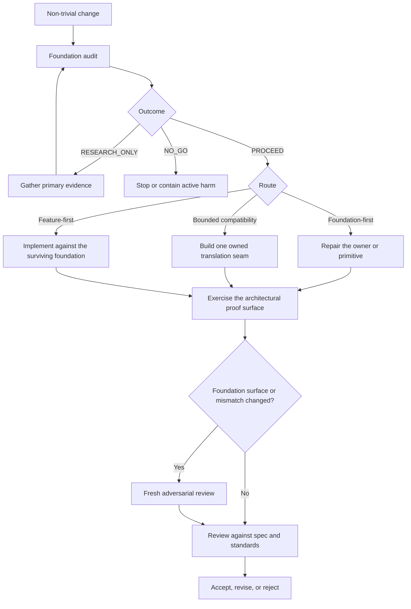

# Foundation Integrity

**Stop locally correct work from hardening the wrong foundation.**

Foundation Integrity is a small, dual-runtime engineering gate for Claude Code and
Codex. It tests ownership, source of truth, lifecycle, trust boundaries, dependency
direction, and system shape before an agent freezes a feature into code, schemas, or
durable APIs.

Distribution is intentionally shell-only. The adopter is transparent, project-scoped,
conflict-aware, and does not change global runtime configuration.

## 1. The failure mode

Most agent workflows optimize the path from specification to green tests. That is
useful when the foundation is sound. When it is not, a capable agent can still make
the feature pass by adding wrappers, parallel authorities, repeated exceptions, or a
new compatibility layer around a misunderstood owner.

The local result looks successful while the system gets harder to reason about:

```text
weak foundation
    -> locally correct workaround
    -> more authorities and exceptions
    -> less human and agent comprehension
    -> stronger dependence on future workarounds
```

Foundation Integrity inserts a falsification gate before implementation and requires
proof of the architectural property at risk—not only proof that the feature works.

## 2. What the pack adds

| Surface | Purpose |
| --- | --- |
| `foundation-audit` | Tries to break the load-bearing claims, then records one classification, outcome, and route. |
| `adversarial-foundation-review` | Gives a fresh independent session the job of finding the strongest counterexample before durable work is accepted. |
| `foundation-health` | Reviews cumulative drift across receipts, ADRs, churn, compatibility seams, and recurring exceptions. |
| Fitness guidance | Helps choose tests, contracts, benchmarks, runtime observations, or structural checks that can expose a fake pass. |
| Runtime and Git hooks | Provide proportional mismatch signals. The default pre-commit posture warns; pre-push blocking is explicit. |
| Coworker policy | Defines an optional single-root, multi-session workflow with bounded roles, write scopes, and digest-bound evidence. It remains inert until explicitly activated. |

The distribution contains exactly 24 skills: three first-party Foundation Integrity
skills and a 21-skill, commit-pinned workflow companion selected from
[`mattpocock/skills`](https://github.com/mattpocock/skills). Provenance, hashes,
license, allowlist, and the local patch ledger live under
[`third_party/mattpocock-skills/`](./third_party/mattpocock-skills/). The companion
does not own the foundation gate or coworker authority.

## 3. Install in 30 seconds

Run the bootstrap from the target repository. Choose exactly one runtime:

```bash
# Codex
curl -fsSL "https://raw.githubusercontent.com/long7400/foundation-integrity/main/scripts/install.sh?$(date +%s)" \
  | bash -s -- --codex

# Claude Code
curl -fsSL "https://raw.githubusercontent.com/long7400/foundation-integrity/main/scripts/install.sh?$(date +%s)" \
  | bash -s -- --claude

# Both runtimes, preview only
curl -fsSL "https://raw.githubusercontent.com/long7400/foundation-integrity/main/scripts/install.sh?$(date +%s)" \
  | bash -s -- --both --dry-run
```

`full-opt` is the only supported payload and is already selected. The explicit
`--full-opt` flag remains accepted for clarity. Useful options:

| Option | Effect |
| --- | --- |
| `--directory <repo>` | Adopt into a repository other than the current directory. |
| `--ref <commit-or-tag>` | Resolve and install one immutable source revision. |
| `--dry-run` | Print the complete effects ledger without mutating the target. |
| `--with-pre-push` | Add the explicit blocking pre-push tier. |
| `--no-pre-commit` | Do not newly wire the warn-only pre-commit hook. |

The bootstrap resolves the requested revision, downloads one archive, prints its
identity, and invokes the project adopter. If you already have a checkout:

```bash
sh templates/setup/full-opt.sh --runtime codex --dry-run /path/to/project
sh templates/setup/full-opt.sh --runtime codex /path/to/project
```

The direct adopter expects the source checkout to have an `origin` remote. For an
intentional source copy without Git metadata, set `FI_SOURCE_REPOSITORY` explicitly;
missing source provenance fails closed. The remote bootstrap always supplies it.

Read the script or use `--dry-run` before any remote shell execution you do not
already trust.

## 4. The complete workflow



### Step 1 — Audit before design freezes

Use the gate before a non-trivial feature, module, migration, refactor, schema,
security boundary, reliability mechanism, or performance architecture:

```text
Use foundation-audit. Audit the foundation this change will load-bear on. Identify
the owner, source of truth, lifecycle, trust boundaries, dependency direction,
intended versus observed behavior, mismatch signals, proof surface, and cheapest
fake pass. Return exactly one classification, one outcome, and one route before
proposing implementation.
```

The receipt must contain:

- one classification: `FOUNDATION_OK`, `FOUNDATION_SUSPECT`, or
  `FOUNDATION_BLOCKED`;
- one outcome: `PROCEED`, `RESEARCH_ONLY`, or `NO_GO`; and
- one route: Foundation-first, Bounded compatibility, or Feature-first.

Only `PROCEED` unlocks dependent implementation. Unknown load-bearing facts remain
research blockers.

### Step 2 — Implement the chosen route

- **Foundation-first:** repair or introduce the missing owner/primitive before the
  dependent feature.
- **Bounded compatibility:** centralize translation behind one owner, contract,
  observability surface, lifecycle, and removal condition.
- **Feature-first:** proceed only because the relevant foundation claims survived
  the available probes.

Apply the smallest containment first if active harm exists. Do not create a second
authority, bypass a trust boundary, or freeze a known mismatch into durable data.

### Step 3 — Prove the claim, not the implementation shape

Choose the strongest available proof: a test, contract run, dependency check,
benchmark, runtime observation, migration rehearsal, or visual inspection. Prefer a
proof that catches the cheapest fake pass and survives harmless internal refactors.

### Step 4 — Challenge durable work independently

After a foundation surface changes, a mismatch signal appears, or a fitness check
regresses, run `adversarial-foundation-review` in a fresh top-level session. Give the
reviewer an open falsification question and exact evidence—not the answer you want
approved. The implementer cannot approve its own durable change.

### Step 5 — Review and monitor cumulative health

Run normal code/spec review after the foundation proof. Every few execution waves,
or when repeated seams and exceptions accumulate, use `foundation-health` to rank
structural repair work that a single feature receipt cannot see.

## 5. What installation changes

| Installed surface | Ownership and behavior |
| --- | --- |
| `.agents/skills/` and/or `.claude/skills/` | The selected checked 24-skill projection. Unrelated consumer skills are preserved. |
| `AGENTS.md` | Created only when absent. Existing `AGENTS.md` and `CLAUDE.md` remain byte-for-byte untouched. |
| `docs/agents/` and `docs/foundation/` | Project conventions, compact rationale, and proof-selection guidance. |
| `.codex/hooks/` and/or `.claude/hooks/` | Project-scoped hook scripts and runtime wiring for the selected runtime. |
| `.orchestration/foundation/` | Static optional coworker policy, selected runtime profiles, and transparent root lifecycle primitives; never activated automatically. |
| `.gitignore` | A marked block for runtime/process state, projections, local research/receipts, temporary files, and local ADR history. Existing unmanaged lines are preserved. |
| `.foundation-integrity/adoption.tsv` | Source version/ref/revision, payload digests, file hashes, modes, selected runtime, and managed ownership. |

The adopter does **not** change global runtime configuration, copy API keys, install
user profiles, open sessions, enable a coworker backend, publish research notes, or
overwrite differing project-owned files. A preflight conflict stops before managed
writes.

The installer is conflict-aware and idempotent, not a transactional package manager.
Its target lock serializes cooperating installer runs; arbitrary concurrent editors
can still race a shell copy. Postconditions detect surviving incomplete or changed
managed state, after which the safe response is to inspect the ledger and rerun.

## 6. Optional coworker flow

The coworker material is an experiment, not the default way to use the pack. Load it
only when independent external sessions are explicitly requested.

Its invariant is small:

- one root owns task state, validation leases, acceptance, release, and teardown;
- peers are read-only; implementers receive explicit non-overlapping write scopes;
- native subagents are not mixed with external coworker sessions;
- session status is an attention signal, never task authority or acceptance proof;
- workers cannot approve their own durable work.

The five primary Codex profiles remain unchanged:

| Profile | Work class | Model | Access |
| --- | --- | --- | --- |
| `fi-root-lead` | control | `gpt-5.6-sol` | workspace write, final authority |
| `fi-peer-scout` | scout | `gpt-5.6-luna` | read-only observations |
| `fi-peer-challenge` | challenge | `gpt-5.6-sol` | read-only counterevidence |
| `fi-implementer-mechanical` | mechanical | `gpt-5.6-luna` | bounded workspace write |
| `fi-implementer-ambiguous` | ambiguous | `gpt-5.6-sol` | bounded workspace write |

Install and attest those five primary envelopes with the reviewed profile manager:

```bash
sh .orchestration/foundation/scripts/manage-codex-profiles.sh status
sh .orchestration/foundation/scripts/manage-codex-profiles.sh install
```

From a Herdr root pane, launch the receipt-bound root and coworkers only through the
transparent primitives. They bind exact profile bytes, the install manifest,
effective CLI overrides, process identity, cwd, and root-owned validation authority:

```bash
exec sh .orchestration/foundation/scripts/launch-codex-root.sh \
  "${TMPDIR:-/tmp}/fi-root.launch.json" "$PWD"

sh .orchestration/foundation/scripts/start-codex-coworker.sh \
  claim-falsifier fi-peer-challenge >"${TMPDIR:-/tmp}/claim-falsifier.launch.json"
```

Transport status and pane telemetry remain attention/continuity signals, never task
authority or acceptance evidence. A release claiming this Codex envelope must also
run the binary-bound runtime tier with a trusted absolute Codex path and an expected
SHA-256 from an independent authenticated record:

```bash
export FI_CODEX_BIN=/absolute/path/to/codex
export FI_CODEX_SHA256=<independently-recorded-sha256>
sh tests/codex-orchestration-acceptance.sh
```

### Optional GLM-5.2 auxiliary profiles

Exactly two lower-cost envelopes are active through a local, loopback-only
compatibility gateway. The five primary Codex profiles and their provider are not
changed:

| Profile | Intended use after compatibility exists | Current status |
| --- | --- | --- |
| `fi-glm-peer-scout` | Read-only inventory, evidence collection, reproduction setup | Active through CLIProxyAPI on `127.0.0.1` |
| `fi-glm-implementer-mechanical` | Well-specified mechanical edits in an explicit write scope | Active through CLIProxyAPI on `127.0.0.1` |

They are not approved for root, challenge, or ambiguous implementation. Both use
`glm-5.2`, `model_reasoning_effort = "max"`, and an explicit
`model_context_window = 272000` rather than the model's larger default context.

The placement is intentionally conservative:

| Evidence class | Public result | Interpretation |
| --- | --- | --- |
| [Vendor model card](https://huggingface.co/zai-org/GLM-5.2) | Terminal-Bench 2.1: 81.0; SWE-bench Pro: 62.1 | Strong coding signal, but vendor-reported. |
| [Artificial Analysis](https://artificialanalysis.ai/models/glm-5-2) | Coding Index about 68.76; Agentic Index about 43.06 | Supports bounded coding work more than high-impact coordination. |
| [Terminal-Bench 2.1](https://artificialanalysis.ai/evaluations/terminalbench-v2-1) and [Hard](https://artificialanalysis.ai/evaluations/terminalbench-hard) | About 77.90% and 50.76% | Independent terminal evidence is strong but not equivalent to architectural judgment. |
| [Small KernelBench comparison](https://github.com/Infatoshi/kernelbench.com/blob/4756f161c809b62e2533e57be3bd46a377412651/media/make_glm52_4way.py) | Four clean results and two timeouts across six tasks | Useful practical counterevidence; far too small for a general ranking. |

These numbers justify bounded roles only; they do not promote GLM to root,
challenge, or ambiguous implementation work. The gateway owns the only protocol
translation seam: Codex speaks Responses to `127.0.0.1`, and the gateway speaks
Chat Completions to Z.AI. Local end-to-end probes covered text, function calls,
tool-result continuation, SSE streaming, loopback binding, and teardown.

Set up and run it explicitly:

```bash
sh .orchestration/foundation/scripts/cliproxy-glm.sh setup
sh .orchestration/foundation/scripts/cliproxy-glm.sh start
eval "$(sh .orchestration/foundation/scripts/cliproxy-glm.sh print-env)"
codex --profile fi-glm-peer-scout
# or: codex --profile fi-glm-implementer-mechanical

sh .orchestration/foundation/scripts/cliproxy-glm.sh doctor
sh .orchestration/foundation/scripts/cliproxy-glm.sh stop
sh .orchestration/foundation/scripts/cliproxy-glm.sh remove
```

`setup` asks for the Z.AI key without echoing it, verifies the pinned v7.2.80
macOS/Linux binary checksum, installs only the two GLM profiles into `$CODEX_HOME`,
stores gateway state under user config/state/data directories with owner-only
permissions, and generates a separate local client key. It refuses to overwrite a
differing profile. The upstream key is never written to a profile or repository.
`remove` stops the process, removes unchanged GLM profile copies, and deletes only
this gateway state; it does not touch the default Codex provider or five primary
profiles.

If an earlier direct-integration test left a differing
`$CODEX_HOME/fi-glm-*.config.toml`, stop any dependent session and remove that old
test copy first; setup deliberately refuses to overwrite it.

This is a workflow boundary, not an operating-system security boundary. Deliberate
out-of-band bypasses remain the user's responsibility.

Primary endpoint references: [Z.AI tool integration](https://docs.z.ai/devpack/tool/others)
and [Coding Plan model selection](https://docs.z.ai/devpack/latest-model).

See [`templates/orchestration/runtime/codex.md`](./templates/orchestration/runtime/codex.md)
for the Herdr launch contract, gateway lifecycle, and removal flow.

## 7. Update and removal

Re-run the shell bootstrap with a new immutable `--ref`. A managed file is updated or
removed only when its current hash still matches the previous adoption ledger. A
consumer edit becomes a conflict instead of being overwritten.

Removal is deliberately ledger-driven rather than destructive:

1. inspect `.foundation-integrity/adoption.tsv`;
2. verify current hashes and modes;
3. remove only unchanged recorded files and hooks;
4. remove the marked Foundation Integrity block from `.gitignore`;
5. remove the adoption ledger after reconciliation.

Deleting repository templates does not remove user-level profiles already copied to
`$HOME/.codex/`. Remove those only after no active session depends on them.

## 8. Source-of-truth rules for maintainers

- `skills/` is the only skill authoring source.
- `.claude/skills/` and `.agents/skills/` are generated runtime projections; never
  edit them directly.
- `VERSION` owns the distribution version.
- `templates/` is authoring input, not a downstream directory layout.
- `.foundation/` and `tmp/` contain runtime/process state and are never canonical.
- Research notes and `docs/foundation/receipts/*.md` remain local working evidence.
  Only `.gitkeep` is tracked for the receipt directory; promote a decision-lossless
  conclusion to an explicit tracked owner when it truly needs to be shared.

After changing a canonical skill:

```bash
sh scripts/sync-runtime-skills.sh
sh tests/repo-contracts.sh
```

## 9. Who this is for

Use Foundation Integrity when a codebase has long-lived ownership, data, APIs,
security boundaries, migrations, or architectural seams—and when “tests are green”
is not enough evidence that the system became healthier.

It is probably unnecessary for a throwaway script, a clearly local mechanical edit,
or a prototype whose deletion boundary is explicit. The gate should be proportional;
it should not turn trivial work into ceremony.

Detailed runtime installation boundaries:

- [Codex installation](./docs/install/codex.md)
- [Claude Code installation](./docs/install/claude.md)

## License

MIT. See [`LICENSE`](./LICENSE).
